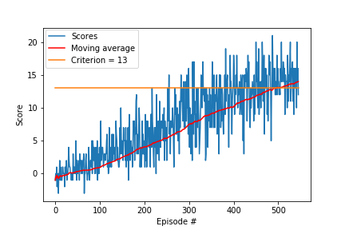

# Conclusion and Outlook
In this article, I discuss the training result of the implemented **DQN Agent**

## Learning Algorithm

As input a vector (size 37) is used instead of the image so no convolutional layer is need. The following deep neural network has following layers:
* Fully connected - input 37 - output 64
* Fully connected - input 64 - output 64
* Fully connected - input 64 - output 64 (action size)

* Linear Activation Function were used

* Adam Optimzer was used to caluclate loss

### Epsilon Greedy

A epsilon-decreasing strategy was used.

### DQN

Utilizing a second “target” network, which we will use to compute target Q-values during our updates.

&Delta;w=&alpha;(R+&gamma;&middot;max &ocirc;(S&apos;,a,w&apos;); - &ocirc;(S,A,w)) &nabla;w o(S,A,w)

with w&apos; fixed target value during training. Are only updated with the Q-network parameters everc C steps ( here C = 4 )

### Experience Replay

Fixed-size buffer to store experience tuples

## Hyperparameters
* Replay Buffer size - BUFFER_SIZE = int(1e5)
* Minibatch size - BATCH_SIZE = 64
* Discount factor - &gamma; = 0.99 
* For soft update target parameters - &tau; = 1e-3
* learning rate - lr = 5e-4                 
* how often network is updated - C = 4        

## Results
The required criterion of an average of 13 points was achieved in less than 500 episodes.

## Outlook
How the agent can be improved:
* Double DQN
* Priorized Experience Replay
* Duelling DQN Network
